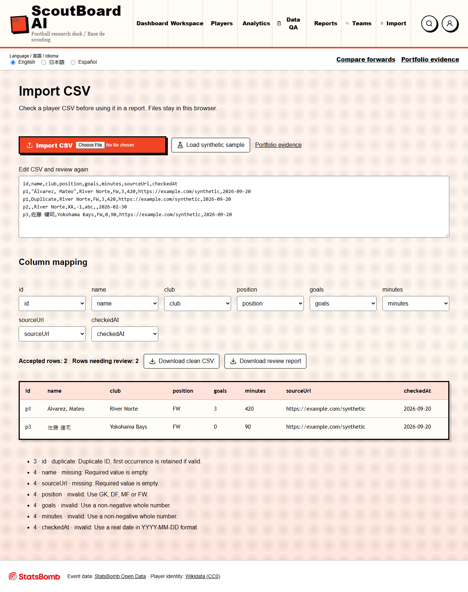
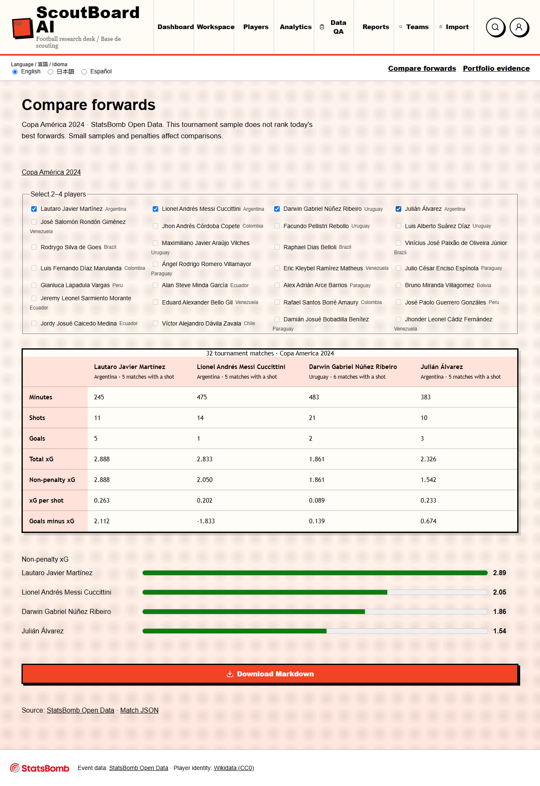


# ScoutBoard AI: research, checks and reports

Self-created portfolio project. No client material is included.

## Problem

Football datasets answer different questions. A player directory is useful for
finding an identity or club claim; event data describes what happened in a match.
Combining them without preserving their scope can produce misleading reports.

## Workflow

1. Import a UTF-8 player CSV and map its columns.
2. Review empty fields, duplicate IDs, invalid numbers, dates and source URLs.
3. Correct rows in the preview; export accepted records and the review report.
4. Browse club groups from imported Wikidata membership claims.
5. Compare two to four attackers using Copa América 2024 event data.
6. Export a report in English, Japanese or Latin American Spanish.

The Next.js app also includes provider readiness, league coverage, research
tasks, before/after text review and Champions League provider setup.

## Technical decisions

- Next.js, TypeScript and React for the main app.
- Papa Parse for quoted CSV, embedded commas and Unicode.
- Browser-side CSV processing; uploaded files do not leave the browser.
- Separate adapters for Wikidata, StatsBomb, Football-Data.org, API-Football
  and Sportmonks. Paid-provider credentials remain server-side.
- Vitest for data behavior and Playwright for browser workflows.
- A static public portfolio sample on GitHub Pages, built from shared CSV,
  localization and report functions. This sample does not need API keys.

## Screens

## Data limits

Club counts describe imported records, not independently verified full squads.
Import dates do not confirm current transfers. Event comparisons cover Copa
América 2024 and cannot rank current forwards across all South American leagues.
xG comes from StatsBomb; ScoutBoard does not train an expected-goals model.

## Verification

`npm test` checks CSV handling, team grouping, sources and existing validations.
`npm run test:e2e` checks CSV downloads, language persistence, localized reports,
comparison limits, club-source links and mobile overflow. `npm run build` verifies
the Next.js production build. Run these commands to obtain fresh results.

## A bug worth documenting

JavaScript accepts some impossible calendar dates by moving them into the next
month. The importer compares the normalized ISO date with the input, so
`2026-02-30` is rejected. The regression is covered by `csv-import.test.ts`.

## What this demonstrates

Data cleanup, source-aware analysis, multilingual reporting and testing can share
one workflow. The useful part is keeping rejected rows and uncertain claims
visible, so a reviewer can decide what to fix before sharing a report.
